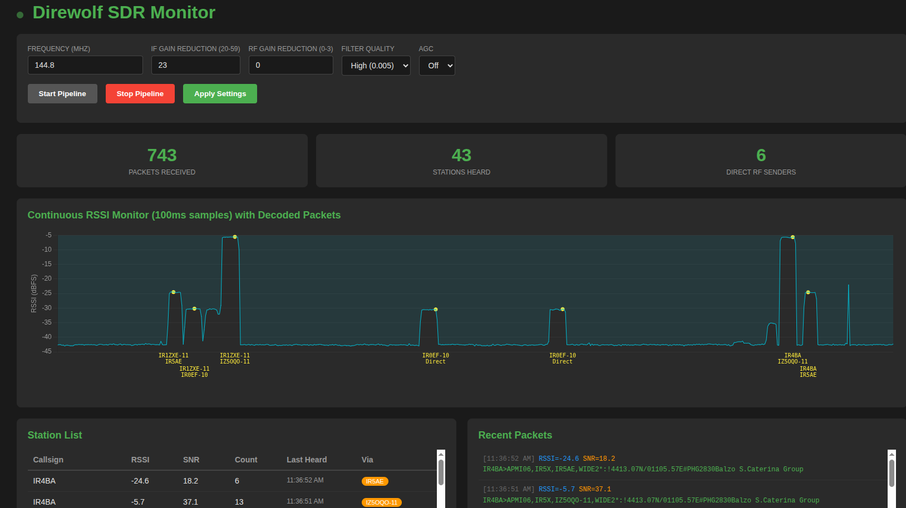

# Web Interface Documentation

## Overview

The web interface is a Flask-based real-time monitoring system for direwolf APRS packet reception. It provides live RSSI/SNR charts, station statistics, and pipeline control through a responsive web dashboard accessible at `http://localhost:5000`.



**Key Features:**
- Real-time continuous RSSI monitoring (100ms sampling)
- Decoded packet display with peak RSSI/SNR metrics
- Station activity tracking (direct vs. digipeated)
- Interactive charts with collision-avoiding labels
- Pipeline control (start/stop SDR→direwolf stream)
- Configurable SDR parameters (frequency, gain, filter quality)

## Architecture

### Components

```
┌─────────────────────────────────────────────────────────────┐
│ Client Browser (Flask frontend)                             │
│ - index.html: UI with Chart.js graphs                       │
│ - WebSocket listeners for real-time updates                 │
└────────────────────────┬────────────────────────────────────┘
                         │ Flask-SocketIO
                         │ (Port 5000)
┌────────────────────────┴────────────────────────────────────┐
│ web_interface.py (Flask Backend)                            │
│ ┌──────────────────────────────────────────────────────┐    │
│ │ HTTP Routes:                                         │    │
│ │ - /api/config: Get/update SDR parameters             │    │
│ │ - /api/pipeline/start|stop: Control SDR stream       │    │
│ │ - /api/stats: Get packet/station counts              │    │
│ │ - /api/packets: Recent packets                       │    │
│ │ - /api/stations: Station list with via tracking      │    │
│ │ - /api/metrics: RSSI/SNR history                     │    │
│ └──────────────────────────────────────────────────────┘    │
│                                                             │
│ ┌──────────────────────────────────────────────────────┐    │
│ │ Threads:                                             │    │
│ │ - pipeline_reader: Parses direwolf output            │    │
│ │ - continuous_rssi_monitor: FIFO-based RSSI reading   │    │
│ │ - socketio.emit: Real-time updates to clients        │    │
│ └──────────────────────────────────────────────────────┘    │
│                                                             │
│ ┌──────────────────────────────────────────────────────┐    │
│ │ Global State:                                        │    │
│ │ - config: SDR params (frequency, gains)              │    │
│ │ - stats: packets, stations, RSSI history             │    │
│ │ - pipeline_running: Boolean flag                     │    │
│ └──────────────────────────────────────────────────────┘    │
└────────────┬─────────────────────────┬──────────────────────┘
             │                         │
    ┌────────┘                         └────────┐
    │                                           │
┌───▼─────────────────────────────┐    ┌────────▼──────────────┐
│ IQ Stream Pipeline              │    │ Monitoring FIFO       │
│                                 │    │ /tmp/direwolf_iq_     │
│ sdrplay_to_direwolf.py          │    │    monitor.fifo       │
│ ↓ (192 kHz CF32)                │    │                       │
│ csdr fir_decimate_cc 8          │    │ Splits IQ stream      │
│ ↓ (24 kHz CF32)                 │    │ for RSSI computation  │
│ tee /tmp/direwolf_iq_monitor.   ├───→ (See continuous_rssi_  │
│     fifo                        │    │  monitor thread)      │
│ ↓                               │    │                       │
│ direwolf -M -t 0 -r 24000       │    └───────────────────────┘
│          -n 1 iq:24000          │
│ ↓                               │
│ APRS Packets                    │
│ (parsed by pipeline_reader)     │
└─────────────────────────────────┘
```

## Key Components Explained

### 1. Pipeline Architecture

The pipeline uses a Unix named pipe (FIFO) to split the IQ stream for two purposes:

```bash
sdrplay_to_direwolf.py          # Reads SDR at 192 kHz
  | csdr fir_decimate_cc 8      # Decimates to 24 kHz (lower bandwidth)
  | tee /tmp/direwolf_iq_       # Splits into two streams:
    monitor.fifo                #   1. To direwolf for packet decoding
                                #   2. To FIFO for RSSI monitoring
  | direwolf ...                # Processes decimated IQ
```

**Why decimation by 8?** Reduces computational load on Raspberry Pi while maintaining adequate bandwidth for 2m APRS (±5 kHz deviation).

**Why tee after decimation?** Ensures RSSI measurement occurs at direwolf's input rate (24 kHz), so the metric is accurate for what direwolf actually receives.

### 2. Continuous RSSI Monitoring

Thread: `continuous_rssi_monitor()`

**Operation:**
1. Opens `/tmp/direwolf_iq_monitor.fifo` for reading
2. Every 100ms, reads 2400 samples (24 kHz × 0.1s) of CF32 data
3. Parses as: `[I₀, Q₀, I₁, Q₁, ..., I₂₃₉₉, Q₂₃₉₉]` (float32 interleaved)
4. Converts to complex array: `z_k = I_k + j·Q_k`
5. Computes instantaneous power: `P = mean(|z|²)`
6. Converts to dBFS: `RSSI_dBFS = 10·log₁₀(P)` (clamped to [-100, 0])
7. Emits to all clients via WebSocket: `{'time': ISO_timestamp, 'value': rssi_dbfs}`

**Storage:** Rolling deque of 600 samples = 60 seconds of history

**Why 100ms intervals?** Provides enough granularity to detect packet envelopes while minimizing network traffic. Each packet (typical 1-2 kHz modulation) lasts ~100-200ms, so sampling every 100ms captures multiple points per packet.

### 3. Packet Parsing

Function: `parse_direwolf_line(line)`

**Input:** Direwolf console output line
```
[0.2] IR5AO>APMI04,IR5X,IZ5OQO-11,WIDE2*:... [RSSI=-28.1 dBFS (S9+19), SNR=32.0 dB]
```

**Output:** Dictionary with:
```python
{
    'timestamp': '2025-12-04T14:23:45.123456',
    'sender': 'IR5AO',
    'path': 'APMI04,IR5X,IZ5OQO-11,WIDE2*',
    'message': '...',  # First 100 chars
    'rssi': -28.1,     # dBFS, enhanced by peak detection
    'snr': 32.0,       # dB, estimated from peak RSSI and noise floor
    'direct': False,   # True if no asterisks in path
    'last_digipeater': 'IZ5OQO-11'  # Last station that processed packet
}
```

**Via Detection Logic:**
- `direct = True`: No asterisks (`*`) anywhere in path → received directly
- `direct = False`: At least one asterisk found → received via digipeater
- Asterisk marks the last station that processed the packet
- Extracts `last_digipeater` by finding the last non-WIDE callsign with `*`

### 4. Peak RSSI Enhancement

Function: `enhance_packet_with_peak_rssi(packet)`

**Problem:** Direwolf reports RSSI at packet end, which is typically weak (noise). We want peak RSSI for better SNR estimation.

**Solution:** Replace direwolf's RSSI with peak value from continuous monitoring:

1. **Find closest continuous sample** to packet timestamp
   - Iterate through 600-sample deque
   - Find sample with minimum time delta from packet time
   - Require match within ±500ms

2. **Search for peak in window**
   - ±5 samples around closest sample (±500ms window)
   - Find maximum RSSI value

3. **Estimate noise floor**
   - Look at ±20 samples (±2 seconds)
   - Find minimum RSSI value
   - Estimated SNR = peak RSSI - noise floor

4. **Update packet**
   - `packet['rssi'] = peak_rssi`
   - `packet['snr'] = estimated_snr`

### 5. Station Tracking

Data structure:
```python
stats['station_list'] = {
    'IR5AO': {
        'first_seen': '2025-12-04T14:23:45.123456',
        'direct': {
            'count': 5,
            'last_seen': '2025-12-04T14:24:10.789456',
            'rssi': -28.1,
            'snr': 32.0
        },
        'via': {
            'IZ5OQO-11': {
                'count': 3,
                'last_seen': '2025-12-04T14:25:15.456789',
                'rssi': -32.5,
                'snr': 28.0
            },
            'IZ5EEL-3': {
                'count': 1,
                'last_seen': '2025-12-04T14:26:00.123456',
                'rssi': -45.0,
                'snr': 10.0
            }
        }
    }
}
```

**Per-packet update:**
1. Check if `direct == True`
   - Update `station['direct']` bucket
2. Else
   - Extract `last_digipeater` from path
   - Create or update `station['via'][last_digipeater]` bucket

### 6. Web Socket Events

#### Client → Server (None in current implementation, all control via HTTP)

#### Server → Client (SocketIO emit)

**`new_packet`** - Emitted when packet is decoded
```javascript
{
    'timestamp': '...',
    'sender': '...',
    'rssi': -28.1,
    'snr': 32.0,
    'direct': true/false,
    'last_digipeater': '...'
}
```

**`continuous_rssi`** - Emitted every 100ms
```javascript
{
    'time': '...',      // ISO timestamp
    'value': -45.2      // dBFS
}
```

**`stats_update`** - Emitted with every packet
```javascript
{
    'packets_received': 123,
    'stations_heard': 42,
    'direct_rf_senders': 28,
    'pipeline_running': true
}
```

## Frontend (index.html)

### Chart Types

#### 1. Continuous RSSI Chart
- **Dataset 1 (line):** Cyan line, 600 samples (60 seconds), updated every 100ms
- **Dataset 2 (markers):** Yellow dots at packet locations with callsign/via labels
- **Collision avoidance:** Level-based layout algorithm
  - Sorts labels left to right
  - Assigns each label to lowest available vertical level
  - Shifts down when horizontal space conflicts detected
- **Tooltips:** Show full packet info on hover (RSSI, Callsign, Via, Time)

### Key Functions

**`addPacketMarkerToRssiChart(packet)`**
1. Parse packet timestamp
2. Find closest RSSI sample in 600-sample deque
3. Search ±5 samples for peak
4. Place marker at peak position
5. Store packet metadata for tooltips and labels

**`packetLabelPlugin`** (Custom Chart.js plugin)
1. Iterate through all packet markers
2. Measure text width for collision detection
3. Use level-based layout algorithm
4. Draw callsign and via at assigned position

**`deriveViaFromPacket(packet)`**
1. Check `direct` field (backend-generated)
2. If direct: return "Direct"
3. If via: return `last_digipeater` (backend-extracted)

## Configuration

File: `scripts/web_interface.py` (lines 34-40)

```python
config = {
    'frequency': 144.8,          # MHz
    'ifgr': 23,                  # IF gain (0-59)
    'rfgr': 0,                   # RF gain (0-27)
    'agc': False,                # Automatic gain control
    'filter_quality': 'high'     # 'standard' or 'high'
}
```

**Update method:**
1. POST to `/api/config` with new values
2. Backend updates config dict
3. If pipeline running: stop, wait 1s, restart with new config

**Note:** Configuration changes require pipeline restart to take effect.

## Running the Interface

### Quick Start

```bash
cd /path/to/direwolf-iq
python3 scripts/web_interface.py
```

Open browser to `http://localhost:5000`

### As systemd Service (Raspberry Pi)

File: `/etc/systemd/system/direwolf-web.service`
```ini
[Unit]
Description=Direwolf Web Interface
After=network-online.target
Wants=network-online.target

[Service]
Type=simple
User=pi
WorkingDirectory=/home/pi/direwolf-iq
ExecStart=/usr/bin/python3 /home/pi/direwolf-iq/scripts/web_interface.py
Restart=always
RestartSec=5

[Install]
WantedBy=multi-user.target
```

Enable and start:
```bash
sudo systemctl daemon-reload
sudo systemctl enable direwolf-web
sudo systemctl start direwolf-web
```

## Dependencies

**Python Packages:**
- `flask` 3.1.2
- `flask-socketio` 5.5.1
- `numpy` (system package `python3-numpy`)
- `soapysdr` (system package `python3-soapysdr`)

**System Requirements:**
- direwolf compiled with IQ input support
- csdr (for decimation filter)
- SDRplay API service (on Raspberry Pi ARM)

**Browser:**
- Modern browser with WebSocket support
- Chart.js 4.4.0 (CDN loaded)

## Performance Considerations

| Metric | Value |
|--------|-------|
| RSSI samples | 600 (60 seconds) |
| RSSI sample rate | 100 ms interval (10 Hz) |
| Packet history | 50 packets |
| Chart update rate | ~10 Hz (continuous RSSI) + event-driven (packets) |
| Memory usage | ~5-10 MB (typical) |
| CPU usage | 8-15% (typical, Raspberry Pi Zero 2 W) |

## Troubleshooting

### FIFO Error: "No such file or directory"
The monitoring FIFO is created dynamically when the pipeline starts. If you see this error:
1. Check `/tmp/direwolf_iq_monitor.fifo` exists when pipeline is running
2. Verify write permissions to `/tmp`
3. Check system logs: `systemctl status direwolf-web`

### No packets appearing
1. Verify SDR is working: check pipeline output via `tail -f` on the FIFO
2. Check frequency is set correctly
3. Verify gains are not too low (check `ifgr` and `rfgr`)

### Chart not updating
1. Verify WebSocket connection: Open browser DevTools → Network → WS
2. Check Flask console for errors: `python3 scripts/web_interface.py` (direct run)
3. Verify port 5000 is open and not blocked by firewall

### High CPU usage on Raspberry Pi
1. Reduce filter quality: Change `filter_quality` to `'standard'`
2. Reduce FFT size in csdr decimation filter
3. Consider higher decimation factor if bandwidth allows

## Extension Points

### Adding New Metrics

1. **Backend:** Add emission in `pipeline_reader()` thread
   ```python
   socketio.emit('new_metric', {'time': timestamp, 'value': metric})
   ```

2. **Frontend:** Add socket listener in `index.html`
   ```javascript
   socket.on('new_metric', (data) => {
       // Update chart or display
   });
   ```

### Adding New Configuration Options

1. **Backend:** Add to `config` dict
   ```python
   config['new_param'] = default_value
   ```

2. **POST handler:** Add case in `update_config()`
   ```python
   if 'new_param' in data:
       config['new_param'] = data['new_param']
   ```

3. **Frontend:** Add input field to HTML form with JavaScript handler

## See Also

- [README.md](README.md) - Main project documentation
- [IQ_INPUT.md](IQ_INPUT.md) - IQ input format details
- [RASPBERRY_PI_SETUP.md](RASPBERRY_PI_SETUP.md) - Raspberry Pi deployment guide
